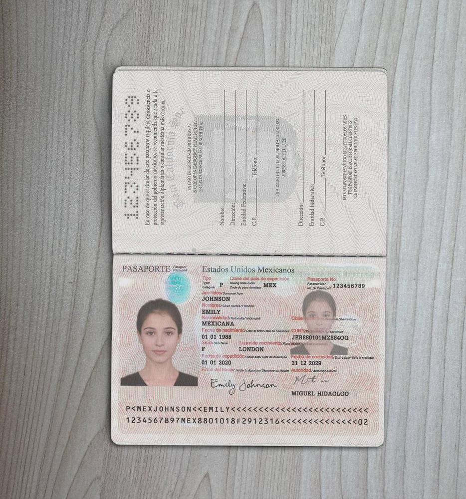
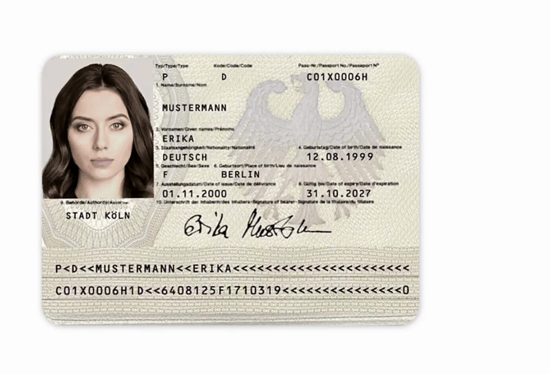
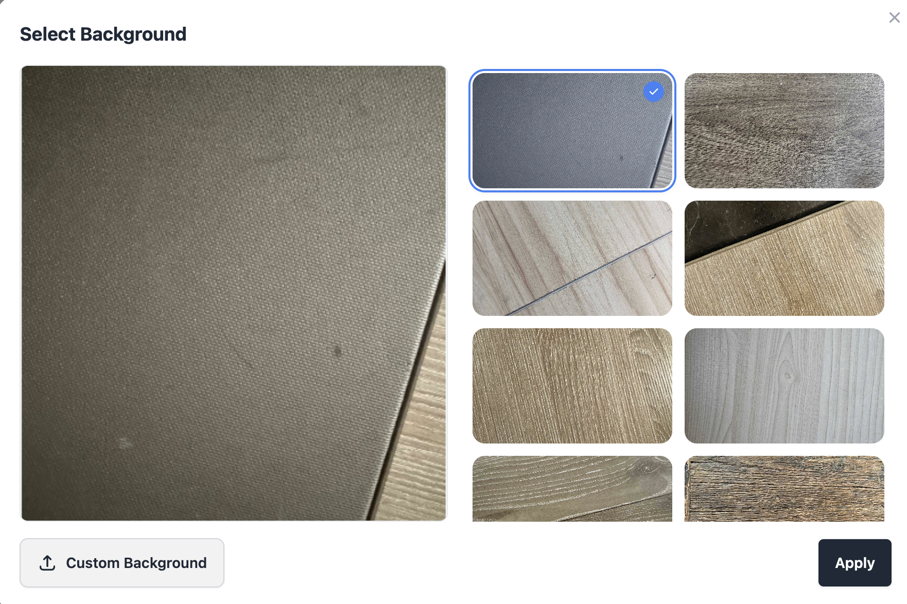

<p align="right">
  <a href="README.md">🇺🇸 English</a> | <a href="README_zh.md">🇨🇳 简体中文</a> | <a href="README_ru.md">🇷🇺 Русский</a> | <a href="README_es.md">🇪🇸 Español</a> | <b>🇩🇪 Deutsch</b> | <a href="README_ja.md">🇯🇵 日本語</a>
</p>

<div align="center">

# 🛂 EasyKYC Dokumentengenerator

### Professionelle Finanzgrad-KYC-Dokumentengenerierungsplattform

[](https://easykyc.ru/de)
[](LICENSE)
[](#)
[](#-technische-standards)

</div>

---

## 🚨 **RECHTLICHER HINWEIS — STRENG VERBOTEN FÜR ILLEGALE ZWECKE**

> ### ⚠️ **WARNUNG: ALLE DOKUMENTE SIND 100% SYNTHETISCH**
>
> Diese Plattform generiert **finanzgrad-synthetische Testdokumente** ausschließlich für:
>
> ✅ **KYC-Verifizierungspipeline-Tests** & Akzeptanzrate-Benchmarking
> ✅ **KI/ML-Modelltraining** (OCR, Gesichtserkennung, Dokumentenklassifikation)
> ✅ **Red Team / Blue Team Sicherheitstests** & Betrugspräventionsforschung
> ✅ **Compliance-Validierung** & Vorbereitung regulatorischer Audits
>
> ❌ **STRENG VERBOTEN**: Identitätsbetrug, Kontoeröffnung, Finanzbetrug, Einwanderungsbetrug oder **jegliche illegale Nutzung**
>
> Durch die Nutzung dieser Plattform **verpflichten Sie sich zur Einhaltung aller geltenden Gesetze**. Missbrauch wird den Behörden gemeldet.

---

<div align="center">

## 🌐 **LIVE-PLATTFORM — JETZT TESTEN**

# 👉 [**easykyc.ru/de**](https://easykyc.ru/de) 👈

### *Generieren Sie KYC-Dokumente in Sekunden — 100% synthetisch, 100% konform*

</div>

<div align="center">
  
  
  
</div>

---

## ✨ Was ist EasyKYC?

**EasyKYC** ist eine professionelle **KYC-Dokumentengenerierungsplattform**. Wir bieten datenschutzsichere, 100% synthetische Testprofile für Ingenieure, Sicherheitsforscher und Compliance-Teams.

---

## 🚀 Kernfunktionen

### 🛂 **Passgenerator**
Generieren Sie standardkonforme Pässe mit **gültigen ICAO 9303 MRZ-Codes** für 15+ Länder:
- 🇺🇸 USA (2007 / 2021)
- 🇬🇧 Vereinigtes Königreich
- 🇫🇷 Frankreich
- 🇲🇽 Mexiko
- 🇯🇵 Japan
- 🇸🇬 Singapur
- 🇮🇳 Indien
- 🇨🇦 Kanada
- 🇧🇾 Belarus
- 🇺🇦 Ukraine
- 🇺🇿 Usbekistan
- 🇹🇼 Taiwan

### 🪪 **Personalausweis- & Führerschein-Generator**
Erstellen Sie nationale Personalausweise und Führerscheine mit ordnungsgemäßen Sicherheitsmerkmalen:
- 🇯🇵 Japanischer Personalausweis
- 🇺🇸 US-Führerschein (MS / WA / NY)
- 🇯🇵 Japanischer Führerschein
- Standardkonforme Chip- und biometrische Daten

### 💰 **Kontoauszugsgenerator**
Generieren Sie Finanzdokumente als Adressnachweis:
- Chase Bank (USA)
- Bank of America (USA)
- Citibank (UK)
- SoCalGas (USA)
- TEPC (Japan)
- Chiba Electric (Japan)
- CityGas (Singapur)

<div align="center">
  <h3>▶️ Live-Demo</h3>
  
</div>

---

## 🌟 Erweiterte Funktionen

<table>
<tr>
<td width="33%" align="center">
  <b>1. Echte MRZ</b><br><br>
  <br><br>
  Streng konform mit dem ICAO 9303 Standard.
</td>
<td width="33%" align="center">
  <b>2. Authentische EXIF</b><br><br>
  <br><br>
  Simulierte Metadaten echter Smartphone-Kameras.
</td>
<td width="33%" align="center">
  <b>3. Benutzerdefinierte Hintergründe</b><br><br>
  <br><br>
  Anpassung an verschiedene Umgebungstestanforderungen.
</td>
</tr>
</table>

---

## 💡 Anwendungsfälle

```
┌────────────────────────────────────────────────────────────────┐
│                                                                │
│  🏦 1. KYC-Verifizierungstests                                │
│     → Testen Sie die Akzeptanzraten Ihrer Verifizierungs-     │
│       pipeline                                                 │
│     → Vergleichen Sie zwischen mehreren KYC-Anbietern         │
│     → Identifizieren Sie Randfälle in Ihrer OCR-Engine        │
│                                                                │
│  🤖 2. KI-Modelltraining                                      │
│     → Trainieren Sie OCR-Modelle mit vielfältigen             │
│       synthetischen Layouts                                    │
│     → Erstellen Sie Gesichtserkennungsdatensätze ohne         │
│       Einwilligung                                             │
│     → Verbessern Sie die Dokumentenklassifikationsgenauigkeit│
│                                                                │
│  🛡️ 3. Red Team / Blue Team Sicherheitstests                  │
│     → Stresstest für Betrugserkennungssysteme                  │
│     → Trainieren Sie Anti-Betrugs-ML-Modelle mit              │
│       gegnerischen Beispielen                                  │
│     → Validieren Sie Dokumentenauthentifizierungs-Workflows  │
│                                                                │
│  📋 4. Compliance & Audit                                     │
│     → Validieren Sie die regulatorische Compliance            │
│       (DSGVO, AMLD, BSA)                                       │
│     → Bereiten Sie audit-bereite Testumgebungen vor           │
│     → Demonstrieren Sie die Verifizierungsabdeckung           │
│       gegenüber Aufsichtsbehörden                             │
│                                                                │
└────────────────────────────────────────────────────────────────┘
```

---

## 🔒 Technische Standards

| Standard | Implementierung |
|:---|:---|
| **MRZ-Format** | ICAO 9303 konform (TD3-Reisepass, TD1-Ausweis) |
| **Prüfziffern** | Gemäß ICAO-Spezifikation validiert |
| **EXIF-Metadaten** | Authentische Mobiltelefon-Kamerametadaten-Injektion |
| **Dokumentenstruktur** | Internationale Standards (ISO/IEC 7501) |
| **Datenschutz** | 100% synthetisch — keine echten PII beteiligt |
| **Regulatorisch** | DSGVO / CCPA / PDPA / BDSG konform |

---

## 📦 Schnellstart

### 🌐 Web-Plattform nutzen (Am einfachsten)

1. **Besuchen Sie** 👉 [**easykyc.ru/de**](https://easykyc.ru/de)
2. **Wählen Sie** Ihren Dokumenttyp (Reisepass / Ausweis / Führerschein / Rechnung)
3. **Konfigurieren Sie** Parameter (Land, Format usw.)
4. **Generieren und herunterladen** — in Sekunden erledigt!

---

## 🔗 Wichtige Links

| 🌐 Ressource | 🔗 Link |
|:---|:---|
| **Hauptplattform** | [easykyc.ru/de](https://easykyc.ru/de) |
| **Passgenerator** | [easykyc.ru/de/passport-generator](https://easykyc.ru/de/passport-generator) |
| **Rechnungsgenerator** | [easykyc.ru/de/bill-generator](https://easykyc.ru/de/bill-generator) |
| **Vordefinierte Pakete** | [easykyc.ru/de/preset-packages](https://easykyc.ru/de/preset-packages) |

---

## 📞 Kontakt & Support

- 🌐 **Webseite**: [easykyc.ru](https://easykyc.ru)
- 📧 **E-Mail**: support@easykyc.ru
- 💬 **Probleme**: [GitHub Issues](https://github.com/EASY-KYC-TOOLS/passport-generator-kyc/issues)
- 📖 **Wiki**: [GitHub Wiki](https://github.com/EASY-KYC-TOOLS/passport-generator-kyc/wiki)

---

<div align="center">

### ⚠️ **ERINNERUNG: NUR FÜR LEGALE ZWECKE** ⚠️

**100% synthetische Dokumente • Für KYC-Tests, KI-Training, Red Team & Compliance**

---

© 2025 EasyKYC. Alle Rechte vorbehalten.

🇺🇸 [English](README.md) | 🇨🇳 [中文](README_zh.md) | 🇷🇺 [Русский](README_ru.md) | 🇪🇸 [Español](README_es.md) | 🇩🇪 Deutsch | 🇯🇵 [日本語](README_ja.md)

</div>
